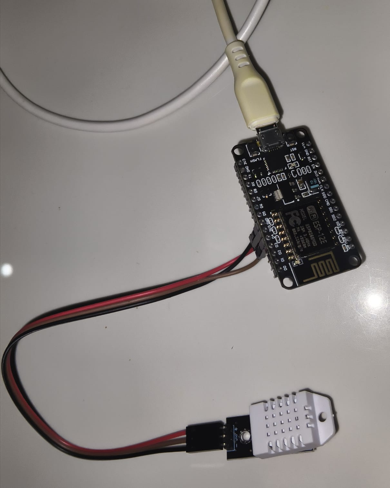
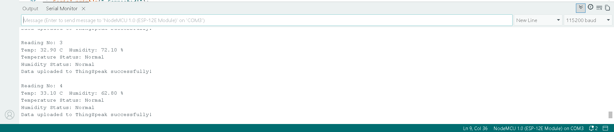
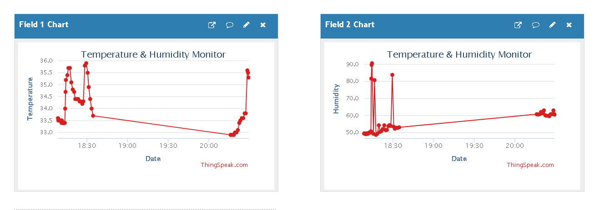
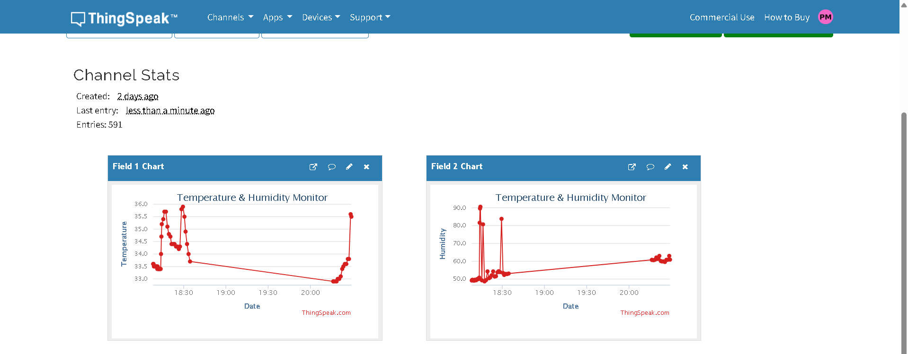

# IoT Temperature & Humidity Monitor

## Project Overview
This project monitors real-time temperature and humidity using a DHT22 sensor connected to an ESP8266 NodeMCU. The sensor readings are uploaded to ThingSpeak cloud platform every 15 seconds for live graphing and monitoring. An alert system notifies when temperature exceeds 35°C or humidity exceeds 80%.

## Platform
- **Hardware:** ESP8266 NodeMCU + DHT22 Sensor
- **Cloud:** ThingSpeak
- **IDE:** Arduino IDE 2.x
- **Difficulty:** Easy
- **Estimated Time:** 2-3 hrs

## Components Used
| Component | Quantity | Description |
|---|---|---|
| ESP8266 NodeMCU | 1 | Wi-Fi microcontroller |
| DHT22 Sensor Module | 1 | Temperature & Humidity sensor |
| Jumper Wires | 3 | Male to Female wires |
| USB Cable | 1 | Power and programming |
| Wi-Fi Router | 1 | Internet connection |

## Circuit Connections
| DHT22 Pin | ESP8266 Pin |
|---|---|
| (+) VCC | 3V3 |
| (OUT) DATA | D4 (GPIO2) |
| (-) GND | GND |

> Note: DHT22 module has built-in pull-up resistor. No external resistor needed.

## Libraries Required
- DHT sensor library by Adafruit
- Adafruit Unified Sensor
- ThingSpeak by MathWorks
- ESP8266WiFi

## Software Setup
1. Install Arduino IDE 2.x
2. Add ESP8266 board URL in preferences:
   http://arduino.esp8266.com/stable/package_esp8266com_index.json
3. Install ESP8266 board package via Boards Manager
4. Install required libraries via Library Manager
5. Create free ThingSpeak account at https://thingspeak.com
6. Create channel with Field 1 = Temperature, Field 2 = Humidity
7. Copy Write API Key and Channel ID

## How to Run
1. Open temperature_humidity.ino in Arduino IDE
2. Replace WiFi credentials in code
3. Replace ThingSpeak API Key and Channel ID
4. Select Board: NodeMCU 1.0 (ESP-12E)
5. Select correct COM port
6. Upload code using Ctrl+U
7. Open Serial Monitor at 115200 baud
8. View live graphs on ThingSpeak dashboard

## Features
- Live temperature and humidity readings
- Data uploaded to ThingSpeak every 15 seconds
- Reading counter for tracking data points
- High temperature alert (above 35°C)
- High humidity alert (above 80%)
- Real-time cloud graphs

## Output
### Circuit Diagram

### Serial Monitor Output

### ThingSpeak Dashboard

## Demo Video
[Watch Demo Video](MiniProject-1.mp4)

## Author
**Poornima M R**
Final Year B.E. Electronics and Communication Engineering
GSSS Institute of Engineering and Technology for Women, Mysuru
VTU Affiliated | 2026 Batch

## Internship
**GlowLogics Solutions Pvt. Ltd.**
IoT Internship 2026
Mini Project 01 - Hardware Simulation
